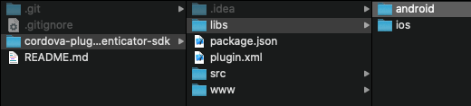
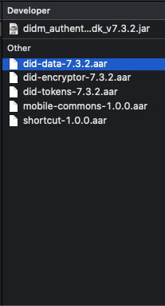
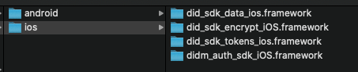

# DetectID-SDK: Cordova Integration

[Description](#desc)

[Technical Information](#tech-desc)

[DetectID-SDK Integration](#SDK-int)

# Description

This repository is meant to help you understand the implementation of the native libraries of DetectID-SDK using Cordova. This repository reviews the initialization of the SDK, account registration processes and authentication services. Notice that all the methods of the SDK are accessed from the *DetectIDCordovaPlugin* class.

# Technical Information
The native libraries of DetectID-SDK have the following specifications:

## DetectID Mobile SDK version
- iOS: 7.3.1
	- did_sdk_data_ios.framework
	- did_sdk_encrypt_iOS.framework
	- did_sdk_tokens_ios.framework
	- didm_auth_sdk_iOS.framework
	
- Android: 7.3.2
	- did-data-7.3.2.aar
    - did-encryptor-7.3.2.aar
    - did-tokens-7.3.2.aar
    - mobile-commons-1.0.0.aar
    - shortcut-1.0.0.aar
    - didm_auth_sdk_v7.3.2.jar

## iOS

 - Base SDK compiled: iOS 12.4.2
 - Xcode: 10.3
 - OS versions compatibility: From 10 to 12.4.2.
 - Programing Language: Objective - C.

## Android

 - API level SDK compiled: 28. (Android 9 - Pie)
 - API level version compatibility: From 19 (Android 4.4 - KitKat) to 28 (Android 9 - Pie). 
 - Programing Language: Java.
 - Dependency: Gson, Dagger 2 y Retrofit 2
 - Android Studio >= 3.4

The examples used below are provided using:
## Cordova

- Node >= v10.14.1
- Phonegap v8.2.2
- Cordova v9.0.1

# DetectID-SDK Integration
On this section, you can review step by step the integration of the SDK and its features.

[Preliminary steps](#prelim)

[Initialization](#Init)

[Device registration](#dev-reg)

[Integrating the authentication services](#int-auth)

## Preliminary Steps
It is necessary to implement a series of preliminary steps to ensure the proper functioning of the SDK in the secured application. Follow the instructions foundin this section to carry out said steps. 

### Native SDK libraries
Copy the native libraries of the SDK into the project of the secured application. Please follow the steps below.

1. After cloning or downloading the **DetectID Mobile SDK for Cordova** project, create a folder named *libs* inside the main folder *cordova-plugin-did-authenticator-sdk*.
2. Inside the *libs* folder, create a new folder for each operating system (Android and iOS).

3. Inside the *Android* folder, copy and paste the *.jar* and *.aar* files shown in the picture below.

4. Inside the *iOS* folder, copy and paste the *.framework* files shown in the picture below.

### Creating the integration application
1. Create a folder in a drive or location of preference. This is the folder where the project will be created. 
2. In the terminal, go to the location of the previously created folder.
3. Run the following command to create the project. 

        sudo cordova create NameYourProject

### Adding the Cordova plugin to the integration project
1. Using the terminal, enter the folder where the secured application was created.
2. Run the following command in the terminal to add the plugin to the integration application.

        sudo cordova plugin add /PATH_TO_THE_PLUGIN/did-mobile-implementation-cordova/cordova-plugin-did-authenticator-sdk

3. Add the platform the application is going to run in. Inside the *platforms* folder, create a folder for each platform. 

        sudo cordova platform add ios
        sudo cordova platform add android 

4. Run the following command to carry out the initial compilation. This command must be executed to compile the application after making changes and see them reflected in the newer compilation. 

        sudo cordova build ios
        sudo cordova build android

5. Steps for Android only: 

    * Add the **Application** in the manifest of the **app** module

            android:name="android.support.multidex.MultiDexApplication"
    *  Add the following line to the gradle of the project

            classpath'com.google.gms:google-services:4.3.0'
   

## Initialization
This process starts all the services of the SDK while evaluating that its version is supported by the server. This process has to be done once per session when the application has started.

#### Syntax
     initDIDServerWithParams : function(success, fail, initParams);  

#### Parameters

 - Callback functions *success* and *fail*.
 - Object initParams, this object contains the URL of the server that receives the registration information.
 
#### Callback implementation
Set the required listeners only once when receiving the success callback. A list of the methods that may be set in this callback is proveded below:

 - setDeviceRegistrationServerResponseListener
 - setRegistrationViewProperties
 - setPushTransactionViewProperties
 - setPushAlertViewProperties
 - setPushTransactionReceiveListener
 - setPushQuickActionServerResponseListener
 - setPushTransactionOpenListener
 - setPushAlertOpenListener
 - setPushAuthenticationResponseAdditionalInfo

#### Implementation example
     var initParams = '{"url": "http://URL:PORT/detect/public/registration/mobileServices.htm?code="}';
     DetectIDCordovaPlugin.initDIDServerWithParams(function(successMsg) {
         console.log("successMsg", successMsg);
     }, function(failedMsg) {
         console.log("failedMsg", failedMsg)
     }, initParams);

## Device Registration
Once the SDK is initialized, it is necessary to register the device to an existing account in the server to enable all the services of DetectID. There are 2 ways to complete this procedure:

### Code Registration
This method registers the device through a code sent via e-mail, SMS or a text message.

#### Syntax
    deviceRegistrationByCode : function (success, fail, code);

#### Parameters
 - Callback functions *success* and *fail*.
 - String code,  registration code sent.

#### Implementation example
     var code = document.getElementById("inputRegistrationCode").value;
     DetectIDCordovaPlugin.deviceRegistrationByCode(function(responseCode) {
         console.log("responseCode", responseCode);
     }, function(failedRegistrationResponse) {
         console.log("failedRegistrationResponse", failedRegistrationResponse)
     }, code);

### QR - Code Registration
This method registers the device through a QR code presented through an external channel (web, ATM, etc.).

#### Syntax
     deviceRegistrationByQRCode : function (success, fail);

#### Parameters
 - Callback functions *success* and *fail*.

#### Implementation example
     DetectIDCordovaPlugin.deviceRegistrationByQRCode(function(responseCode) {
         console.log("responseCode", responseCode);
     }, function(failedRegistrationResponse) {
         console.log("failedRegistrationResponse", failedRegistrationResponse)
     });

#### Android specific configuration
In Android, it is necessary to use an external resource to use the camera of the mobile device in QR Code registration procedures. In this implementation, a Cordova additional pulgin is used for this purpose: however, the secured entity is free to use the camera of the device and to obtain the required permission. The details of the plugin and permissions used in this implementation can be found below:
 - Plugin name: cordova-plugin-android-permissions
 - Plugin link: https://www.npmjs.com/package/cordova-plugin-permission
 - Implementation JavaScript: This implementation code must be implemented only once when initializing the application: 
	var permissions = cordova.plugins.permissions;
		permissions.requestPermission(permissions.CAMERA, success, error);

		function error() {
		  console.warn('Camera permission is not turned on');
		}

		function success(status) {
		  if(!status.hasPermission) {
		      error();
		   }
		}

 - Add the following line of code to the gradle of the project:
	classpath 'com.google.gms:google-services:4.3.0'
	
### Registration Response
The success callbacks of both registration methods receive the response codes of the registration process. The list of response codes can be found below: 
	
#### Response
 - 98 Empty Parameter
 - 99 System Error
 - 1002 The activation code was already used
 - 1010 Operating System not supported
 - 1011 Activation code does not exist
 - 1012 Activation code has expired
 - 1013 client has reached maximum number of devices allowed
 - 1014 The device is already registered
 - 1020 Successful registration
 
### Registration Response Listener
This listener must be set to allow the registration success callbacks to handle the server response codes. 

#### Syntax
     setDeviceRegistrationServerResponseListener : function (success, fail);

#### Parameters
 - Callback functions *success* and *fail*.

####  Implementation example
      DetectIDCordovaPlugin.setDeviceRegistrationServerResponseListener (
          function(success) {
              console.log("onSuccess", success);
          },
          function(error) {
              console.log("onError", error);
          }
      );

### Additional device registration methods

The methods found below must be implemented only once right after the application has finished loading. Their implementation is optional. 
#### *displayDeviceRegistrationDialog*
This method allows to use the default view of the SDK´s device registration dialog. The configurability of this default view is limited, so its use is not recommended. This method receives 2 parameters: 2 response callbacks.
##### Syntax
      displayDeviceRegistrationDialog : function (success, fail);
##### Implementation
      DetectIDCordovaPlugin.displayDeviceRegistrationDialog(
      	function(success) {
      		console.log("onSuccess", success);
      	},
      	function(error) {
      		console.log("onError", error);
      	}
      );

#### *setRegistrationViewProperties*
This method allows to configure the default view of the SDK´s device registration dialog. The configurability of this default view is limited, so its use is not recommended. This method receives 3 different parameters: 2 response callbacks and an registrationViewProperties object.    
##### Syntax
	  setRegistrationViewProperties : function (success, fail);
##### Implementation
      var registrationViewProperties = {
        "TITLE": "Configured title",
        "MESSAGE": "Configured message",
        "CONFIRM": "Accept transaction",
        "CANCEL": "Reject transaction",
        "SERVER_RESPONSE_CODE_98": "Code 98",
        "SERVER_RESPONSE_CODE_99": "Code 99",
        "SERVER_RESPONSE_CODE_1002": "Code 1002",
        "SERVER_RESPONSE_CODE_1010": "Code 1010",
        "SERVER_RESPONSE_CODE_1011": "Code 1011",
        "SERVER_RESPONSE_CODE_1012": "Code 1012",
        "SERVER_RESPONSE_CODE_1013": "Code 1013",
        "SERVER_RESPONSE_CODE_1014": "Code 1014",
        "SERVER_RESPONSE_CODE_1020": "Code 1020",
        "CAMERA_PERMISSION_REQUEST": "CAMERA_PERMISSION_REQUEST",
        "CAMERA_PERMISSION_SETTINGS": "CAMERA_PERMISSION_SETTINGS",
        "CAMERA_PERMISSION_CANCEL": "CAMERA_PERMISSION_CANCEL"
      };
      DetectIDCordovaPlugin.setRegistrationViewProperties (
        function(success) {
            console.log("onSuccess", success);
        },
        function(error) {
            console.log("onError", error);
        }, registrationViewProperties);

## Account Management
This service allows the SDK to manage different accounts through the customer application. This section contains the methods provided in this SDK to manage said accounts. 

#### *getAccounts*
Allows to retreive the list of registered accounts.
##### Syntax
	 getAccounts : function (accountList);
	
##### Implementation
   	 DetectIDCordovaPlugin.getAccounts(function(accountList) {
            ...
   	 });	

#### *removeAccount*
This method can be used to delete an account. This method uses the parameter currentAccount which corresponds to the account that is about to be erased from the device. 
##### Syntax
	 removeAccount: function(success, fail, currentAccount);
##### Implementation
	 let currentAccount = accountList[index];
		DetectIDCordovaPlugin.removeAccount(function(response){
	          ...
     }, function(response) {
	          ...
	 }, currentAccount);

#### *setAccountUsername*
This mthod is used to update the user name of an account. This method uses the parameter currentAccount which corresponds to the account that is about to be modified. 
##### Syntax
	 setAccountUsername: function (success, fail, username, currentAccount);
##### Implementation
	 let currentAccount = accountList[index];
		let newUsername = "xxxxxx";
		DetectIDCordovaPlugin.setAccountUsername(function(response){
     	...
     }, function(response) {
     	...
     }, newUsername, currentAccount);
	 
## Integrating the authentication services         
With the initialization and registration process finished, the SDK is ready to start using its authentication services.

[OTP Authentication](#OTP-auth)

[Push Authentication](#push-auth)

### OTP
This feature allows to authenticate the user through one-time passwords generated by the SDK inside the secured entity's mobile application.

#### *updateTokenTimeStepValue*
This method Calls the server to update the lifetime of the token for a specific account. It receives 3 different parameters: 2 response callbacks and an currentAccount object. This object corresponds to the account that will receive the OTP timestep change.
##### Syntax
      updateTokenTimeStepValue  : function (success, fail, account);
 
##### Implementation
      let currentAccount = accountList[index];
			DetectIDCordovaPlugin.updateTokenTimeStepValue(function(response) {
					...
				}, function(error) {
					...
				}, currentAccount
			);

#### *getTokenValue*
This method returns a string with the value of the token at the time of the query for the specified account. It receives 3 different parameters: 2 response callbacks and a currentAccount object. This object corresponds to the account that will receive the OTP.
##### Syntax
      getTokenValue  : function (success, fail, account);
 
##### Implementation
      let currentAccount = accountList[index];
	  DetectIDCordovaPlugin.getTokenValue(function(tokenValue) {
					...
			}, function(error) {
					...
			}, currentAccount
	  );

### Push authentication
These feature allows to use push notifications to provide user authentication services, as well as informative push alerts to relay information to the user. 
The methods found below must be implemented only once right after the application has finished loading.

#### *setPushTransactionViewProperties*
This method allows to configure the default view of the SDK´s push transaction service. This method receives 3 different parameters: 2 response callbacks and an transactionViewProperties object.    
##### Syntax
      setPushTransactionViewProperties : function (success, fail, transactionViewProperties);
##### Implementation
      var transactionViewProperties = {
			"TITLE": "Configured title",
			"MESSAGE": "Configured message",
			"CONFIRM": "Accept push",
			"DECLINE": "Reject push",
			"ENABLE_NOTIFICATION_QUICK_ACTIONS" : "true", // true | false
	  };

	  DetectIDCordovaPlugin.setPushTransactionViewProperties ( function(success) {
			 ...
			}, function(error) {
			 ...
			}, transactionViewProperties
	  );
     
#### *setPushAlertViewProperties*
This method allows to configure the default view of the SDK´s push alert service. This method receives 3 different parameters: 2 response callbacks and an alertViewProperties object.
##### Syntax
      setPushAlertViewProperties  : function (success, fail, alertViewProperties);
##### Implementation
      var alertViewProperties = {
			"APPROVE": "Accept"
	  }

	  DetectIDCordovaPlugin.setPushAlertViewProperties ( function(success) {
			...
			}, function(error) {
			...
			}, alertViewProperties
	  );			

#### *setPushQuickActionServerResponseListener*
This method is used to obtain the responsed codes of Push QUick Actions. Each time a transaction is accepted or rejected, it is necessary to set the corresponding listener to receive the response codes again. If said listener is not set, it will not be possible to accept or reject transactions. This method receives 2 different parameters: 2 response callbacks. 
##### Syntax
      setPushQuickActionServerResponseListener : function(success, fail);
##### Implementation
	  var failResponse = function(message) {
			alert(message, "Fail Response");
			DetectIDCordovaPlugin.setPushQuickActionServerResponseListener(successResponseQuickAction, failResponse); // get response listener from QuickActions
	  };

	  var successResponseQuickAction = function(responseCode) {
			alert(responseCode, "Quick Actions Response");
			DetectIDCordovaPlugin.setPushQuickActionServerResponseListener(successResponseQuickAction, failResponse); // get response listener from QuickActions
	  };

	  DetectIDCordovaPlugin.setPushQuickActionServerResponseListener(successResponseQuickAction, failResponse);

#### *setPushTransactionReceiveListener*
This listener is executed every time a Push transaction is received in the application. It is useful when the company wants to implement any additional functionality when receiving the notification. 
This method receives 2 different parameters: 2 response callbacks. 
##### Syntax
      setPushTransactionReceiveListener : function(success, fail)
##### Implementation
      DetectIDCordovaPlugin.setPushTransactionReceiveListener(function(successTransactionReceiveListener) {
          console.log("successTransactionReceiveListener", successTransactionReceiveListener);
      }, function(failTransactionReceiveListener) {
          console.log("failTransactionReceiveListener", failTransactionReceiveListener)
      });
	  
#### *setPushTransactionOpenListener*
This listener is executed every time a Push transaction is opened from the Notifications panel; useful when the company wants to implement any additional functionality when the notification opens. 
This method receives 2 different parameters: 2 response callbacks. The success callback contains the parameter pushTransactionMsg. This parameter returns all the information in the Pushmessage when the notification is opened. This information ca be used to build the push transaction view. The QuickAction listener must be set each time a transaction is accepted or rejected in order to receive future push transaction messages. 
##### Syntax
      setPushTransactionOpenListener : function(success, fail)
##### Implementation
	  <!-- The following is an implementation example for this listener; however, the secured entity is free to implement it as they see fit. It is mandatory to set the QuickAction listener for each action as seen below -->
   	  var pushTransactionOpenListener = function(pushTransaction) {
			var r = confirm("xxxxxx");
			if (r == true) {
			DetectIDCordovaPlugin.confirmPushTransactionAction(function(responseCode){
						alert(responseCode,"Confirm Transaction Response");
						DetectIDCordovaPlugin.setPushQuickActionServerResponseListener(successResponseQuickAction, failResponse); // get response listener from QuickActions
				}, failResponse, pushTransaction);
			} else {
			DetectIDCordovaPlugin.declinePushTransactionAction(function(responseCode){
						app.dialog.alert(responseCode,"Declined Transaction Response");
						DetectIDCordovaPlugin.setPushQuickActionServerResponseListener(successResponseQuickAction, failResponse); // get response listener from QuickActions
					}, failResponse, pushTransaction);
			}
   	  };
   
   	  DetectIDCordovaPlugin.setPushTransactionOpenListener(pushTransactionOpenListener, failResponse);

#### *setPushTransactionActionListener*
This method overrides the methods to confirm or reject the Push transaction. It is useful when implementing an additional functionality in these methods. 
This method receives 2 different parameters: 2 response callbacks. 
##### Syntax
      setPushTransactionActionListener : function(success, fail)
##### Implementation
      DetectIDCordovaPlugin.setPushTransactionActionListener(function(successTransactionActionListener) {
          console.log("successTransactionActionListener", successTransactionActionListener);
      }, function(failTransactionActionListener) {
          console.log("failTransactionActionListener", failTransactionActionListener)
      });

#### *confirmPushTransactionAction*
Executes the action to confirm the last received transaction; it is useful to implement or control the visualization of the Push transaction. 
This method will receive as parameter the TransactionInfo object in order to identify what transaction confirm among all those received.
This method receives 3 different parameters: 2 response callbacks and an TransactionInfo object.   
##### Syntax
	  confirmPushTransactionAction : function(success, fail, transactionJson)
##### Implementation
      DetectIDCordovaPlugin.confirmPushTransactionAction(function(successConfirmTransactionActionListener) {
          console.log("successConfirmTransactionActionListener", successConfirmTransactionActionListener);
      }, function(failConfirmTransactionActionListener) {
          console.log("failConfirmTransactionActionListener", failConfirmTransactionActionListener)
      }, transactionJson);

#### *declinePushTransactionAction*
This method executes the action to decline the received transaction; it is useful to implement or control the visualization of the Push transaction. 
It the TransactionInfo object as parameter to identify what transaction will be declined among all receide transactions.
This method receives 3 different parameters: 2 response callbacks and an TransactionInfo object.
##### Syntax
      declinePushTransactionAction : function(success, fail, transactionJson)
##### Implementation
      DetectIDCordovaPlugin.declinePushTransactionAction(function(successDeclineTransactionActionListener) {
          console.log("successDeclineTransactionActionListener", successDeclineTransactionActionListener);
      }, function(failDeclineTransactionActionListener) {
          console.log("failDeclineTransactionActionListener", failDeclineTransactionActionListener)
      }, transactionJson);

#### *setPushAuthenticationResponseAdditionalInfo*
This method includes additional information to the Push authentication answer that is being being executed in the end-use's mobile device. 
For example, if the secured entity wants to send the exact hour in which the Push authentication is being accepted or declined, that value can be sent as additional information. 
This method receives Map kind collection called additionalinfo as a parameter, with the structure <key, value>. The values included in the additionalInfo field will be sent to DetectID to be consulted by the secured entity.

##### Syntax
      setPushAuthenticationResponseAdditionalInfo : function(success, fail, additionalInfoJson)
##### Implementation
      var mappAdditionalInfo = {
          "MAP": "VALUE",
          "MAP2": "VALUE2",
          "MAP3": "VALUE3",
          "MAP4": "VALUE4"
      }
	  
      DetectIDCordovaPlugin.setPushAuthenticationResponseAdditionalInfo(function(successSettingAdditionalInfo) {
          console.log("successSettingAdditionalInfo", successSettingAdditionalInfo);
      }, function(failSettingAdditionalInfo) {
          console.log("failSettingAdditionalInfo", failSettingAdditionalInfo)
      }, mappAdditionalInfo);

#### *setPushAlertViewProperties*
This method updates the object that contains the configuration of texts and icons of Push notifications and QuickActions. This method receives 3 different parameters: 2 response callbacks and an alertViewProperties object.    
##### Syntax
      setPushAlertViewProperties  : function (success, fail, alertViewProperties);
##### Implementation
	  var alertViewProperties = {
	  "APPROVE": "Accept"
	  }

	  DetectIDCordovaPlugin.setPushAlertViewProperties ( function(success) {
	  ...
	  }, function(error) {
      ...
	  }, alertViewProperties);
	  
#### *setPushAlertReceiveListener*
This listener is executed every time a Push alert is received in the application; useful for the implementation of any additional functionalities when receiving the notification. 
The listener will contain the information necessary to handle one or multiple received alerts. This method receives 2 different parameters: 2 response callbacks. 
##### Syntax
      setPushAlertReceiveListener  : function (success, fail);
##### Implementation
      DetectIDCordovaPlugin.setPushAlertReceiveListener (
          function(success) {
              console.log("onSuccess", success);
          },
          function(error) {
              console.log("onError", error);
          });

#### *setPushAlertOpenListener*
This listener is executed every time a Push alert is opened from the Notifications panel; useful when the company wants to implement any additional functionality when the notification opens. 
This method receives 2 different parameters: 2 response callbacks. 
##### Syntax
      setPushAlertOpenListener  : function (success, fail);
##### Implementation
      DetectIDCordovaPlugin.setPushAlertOpenListener (
          function(success) {
              console.log("onSuccess", success);
          },
          function(error) {
              console.log("onError", error);
          });
	  
#### *approvePushAlert*
This method executes the action to approve the received alert, it is useful to implement or control the Push transaction visualization. 
The listener will return a transactionJson object, which will contain the information necessary to handle one or multiple received alerts.
This method receives 3 different parameters: 2 response callbacks and an transactionJson object.    
##### Syntax
      approvePushAlert  : function (success, fail, transactionJson);
##### Implementation
      var transactionJson = {
          ...
      }
      DetectIDCordovaPlugin.approvePushAlert (
          function(success) {
              console.log("onSuccess", success);
          },
          function(error) {
              console.log("onError", error);
          }, transactionJson);
	  
	  
## Author
DID SDK, didsdk-admin@cyxtera.com
## License
© 2019, Cyxtera Cybersecurity, Inc. All rights reserved. Redistribution and use in source and binary forms, with or without modification, are permitted provided that the following conditions are met: (a) redistributions of source code must retain the above copyright notice, this list of conditions and the disclaimer below, and (b) redistributions in binary form must reproduce the above copyright notice, this list of conditions and the disclaimer below in the documentation and/or other materials provided with the distribution. THE CODE AND SCRIPTS POSTED ON THIS WEBSITE ARE PROVIDED ON AN “AS IS” BASIS AND YOUR USE OF SUCH CODE AND/OR SCRIPTS IS AT YOUR OWN RISK. CYXTERA DISCLAIMS ALL EXPRESS AND IMPLIED WARRANTIES, EITHER IN FACT OR BY OPERATION OF LAW, STATUTORY OR OTHERWISE, INCLUDING, BUT NOT LIMITED TO, ALL WARRANTIES OF MERCHANTABILITY, TITLE, FITNESS FOR A PARTICULAR PURPOSE, NON-INFRINGEMENT, ACCURACY, COMPLETENESS, COMPATABILITY OF SOFTWARE OR EQUIPMENT OR ANY RESULTS TO BE ACHIEVED THEREFROM. CYXTERA DOES NOT WARRANT THAT SUCH CODE AND/OR SCRIPTS ARE OR WILL BE ERROR-FREE. IN NO EVENT SHALL CYXTERA BE LIABLE FOR ANY DIRECT, INDIRECT, INCIDENTAL, SPECIAL, RELIANCE, EXEMPLARY, PUNITIVE OR CONSEQUENTIAL DAMAGES, OR ANY LOSS OF GOODWILL,LOSS OF ANTICIPATED SAVINGS, COST OF PURCHASING REPLACEMENT SERVICES, LOSS OF PROFITS, REVENUE, DATA OR DATA USE, ARISING IN ANY WAY OUT OF THE USE AND/OR REDISTRIBUTION OF SUCH CODE AND/OR SCRIPTS, REGARDLESS OF THE LEGAL THEORY UNDER WHICH SUCH LIABILITY IS ASSERTED AND REGARDLESS OF WHETHER CYXTERA HAS BEEN ADVISED OF THE POSSIBILITY OF SUCH LIABILITY.

[//]: #

[cyxtera]: <https://www.cyxtera.com>

